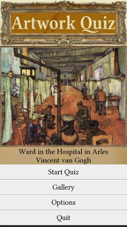
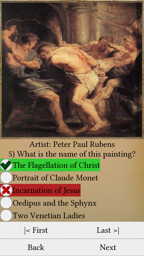
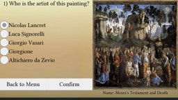

# Portfolio
## Games
### Artwork Quiz 

A quiz that tests a user's knowledge of various pieces of classical artwork.

[Link to app](https://play.google.com/store/apps/details?id=com.homefriend.artquiz.android)

___
## Projects
### Java samples
Samples of Java code all under one application.

[Link to project](https://github.com/Homiesoft/java-samples)
### Flight Simulator (WIP)
A 3D flight simulator created with LibGDX.

[Link to project](https://github.com/Homiesoft/FlightSim)
## Python samples
Code samples in Python

[Link to project](https://github.com/Homiesoft/PySolutions)
### Cookie Chip
A .NET Chip8 emulator.

[Link to project](https://github.com/Homiesoft/CookieChip)
### AdLibs
A sample website done in PHP.

[Link to project](https://github.com/Homiesoft/AdLibs)
